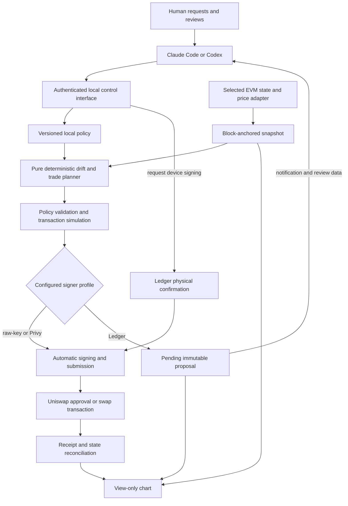

# Rebalance — implementation plan

Created: **2026-09-04**. Track: **ETHOnline 2026, Start from Scratch**.
Current scope: **deterministic automatic execution for local-key/Privy profiles; device-confirmed execution for Ledger**. No application code or project deployments exist yet. Robinhood remains viable; Base is a recommended alternative under the user's any-L2 preference. Final network selection follows the [integration gates](docs/NETWORK.md), not an assumed Ledger EVM limitation.

The [latest clarifications](docs/prompts/005-ledger-stack-and-execution-modes.md) establish signer-specific execution modes and supersede earlier vault/session-key designs and the interim all-modes-confirmed interpretation. Historical plans/prompts remain in Git. Cloud LLM input and Privy's TEE signing are accepted; raw-private-key support is required; physical Ledger testing waits for the device to arrive.

## 1. Product and first milestone

Build a local EVM portfolio monitor and rebalancer. Claude Code/Codex is the sole application command and review interface. The local pie chart only displays current/target weights, balances, pending proposals and execution status.

The deterministic daemon detects excessive drift, calculates a corrective trade and validates it against the configured policy. Local-key and Privy profiles then sign and execute automatically. Ledger profiles queue a request for the owner to confirm on the device. No LLM decides when drift is excessive, what amounts to trade, or whether the plan passes validation. Automatic execution continues with the coding agent closed.

The MVP supports three explicit signer profiles: local raw private key, Ledger and Privy. Configuring a local-key or Privy profile for automation authorizes swaps and necessary finite approvals within its versioned policy; no per-trade human input is required. Ledger requires physical confirmation for each signing operation. Switching modes/accounts or changing policy is an agent-mediated user command, never a silent fallback.

**First integration milestone:** agent configures a raw-key profile and target → deterministic drift detection → validated transaction → automatic testnet swap and receipt → view-only chart update. Local fixtures/forks are test tools, not the completion criterion for the network integration. Use a small test portfolio of two or three assets and one quote asset. A stock-like test token is acceptable if clearly labelled; it does not represent real equity.

Evaluate Robinhood mainnet/testnet (4663/46630) and Base/Base Sepolia (8453/84532) before pinning the demo manifest. Base Sepolia is the recommended first-network candidate because official Uniswap testnet deployments are documented. Verify ETH/USDC routing first; display stocks only from canonical asset/price data. Actual stock swaps require an executable Uniswap route, which is not yet verified on either candidate. Aerodrome stock liquidity is not Uniswap integration evidence. Verify token/pool/feed identities and Ledger Agent Stack compatibility. If official testnet liquidity is unavailable, use documented, licensed upstream test deployments and labelled test assets on the selected testnet. Keep network gaps explicit; do not present a local fork receipt as a network transaction or silently switch a configured chain. Mainnet trading is outside this planning task.

## 2. Use Ledger Agent Stack first

Reuse Ledger's existing tools wherever they satisfy the product's chain, approval, privacy and signer requirements. Read the [source-backed assessment](docs/LEDGER_AGENT_STACK.md) before choosing an adapter.

- Use the official `ledger-dmk-implementation`, `dmk-intent-vocabulary` and `dmk-business-logic` skills during implementation. Reuse DMK, the Ethereum signer, native transport, device lifecycle and Clear Signing components.
- Evaluate Wallet CLI JSON workflows and reusable swap-flow/intent components before writing equivalents. Its Uniswap provider is real. The docs advertise EVM support, and shared EVM configuration includes Robinhood mainnet/testnet and Base. The inspected CLI quote command has a narrower currency allowlist; execution follows a separate path. Do not generalize that quote restriction to all CLI/EVM support. Verify the packaged account-to-quote-to-sign flow on the selected chain.
- The current CLI executes a fresh quote rather than a previously prepared transaction. It has no exposed quote-ID/minimum-output/slippage controls sufficient for our policy boundary. Validate the final transaction through reusable components; extend upstream where practical. Do not assume the stock swap command preserves an earlier preview or our limits.
- Evaluate `wallet-cli ring` for hardware-anchored credential storage and a narrow local credential broker for service-backed modes. Ring provides encryption, not a ready-made scoped API proxy. Keep this integration proportional to the credentials the app actually needs.
- Keep the native CLI's telemetry and hosted swap services out of any claimed telemetry-free/local-only path. Verify pinned-version behavior rather than silently bundling it unchanged.

Original project work should concentrate on deterministic allocations/drift, policy-bounded execution, agent workflow, Ledger confirmation, transaction recovery and the view-only chart. There is **no custom custody vault or delegated session-key contract in the MVP**. The local daemon can execute direct owner-signed wallet transactions automatically for raw-key/Privy profiles.

## 3. User flow

1. Ask the agent to configure the network, wallet/signer mode, target allocation, drift threshold and notification/snooze preferences. Secret values are referenced from local storage, never pasted into model prompts.
2. Ask the agent to open the chart. It has no editors, action buttons, wallet transport, signing access or mutation credentials.
3. The daemon periodically reads state and deterministically prepares a trade when drift exceeds the threshold. Automatic profiles validate, sign and submit without a model call. Ledger profiles queue a notification without invoking a model; the agent presents it when available, and the trade waits for physical confirmation.
4. Review the complete allocation change or transaction through the agent. For example, ETH 20%, stock-test 40%, quote 40% becomes 30%, 35%, 35% when the other allocations are proportionally reduced.
5. In Ledger mode, review the exact operation and confirm on the device. In automatic modes, the configured policy authorizes valid trades; no agent conversation or per-operation confirmation is needed.
6. Track each ERC-20 approval/permit and swap separately. Automatic modes may execute finite approvals for approved spenders within policy. Ledger asks for every required signature. Record allowances left behind if a later swap fails.
7. Reconcile the receipt, update balances and show progress. Plan the next corrective trade only from fresh confirmed state. Pause/resume automation, cancel/snooze pending Ledger proposals and inspect history through the agent.

Changing target weights is a versioned local policy change requested through the agent; it updates the rules used by enabled automation. It does not install onchain spending restrictions. Existing ERC-20 allowances are separate; display them and support approval-revocation requests through the agent.

## 4. Architecture

Proposed stack: TypeScript for schemas/core/local service, a bundled React/SVG chart, SQLite for durable state, current supported Ledger libraries, and a typed EVM client for state/Uniswap calls. Use Foundry only where meaningful upstream-contract/fork integration checks require it. Pin dependency versions, licenses and source commits as they are adopted.

| Area | Responsibility |
| --- | --- |
| `packages/core` | Canonical schemas, integer arithmetic, target redistribution, drift and trade planner |
| `packages/chain` | Selected-chain manifests, price checks, Uniswap route/transaction construction |
| `packages/signers` | Exact-operation signing interface and local raw-key implementation |
| `packages/ledger` | Agent Stack/DMK adapter, native device flow and supported reusable swap components |
| `packages/privy` | Privy wallet adapter, scoped authorization and API operation recovery |
| `packages/credentials` | Local secret references and optional Ring-backed constrained broker |
| `packages/cli` | Agent-facing status, policy/proposal review, confirmation, pause/resume and cancellation |
| `apps/daemon` | Monitor, pending-request queue, read API, control IPC, durable transaction lifecycle |
| `apps/ui` | View-only local portfolio and operation status |
| `docs` | Plans, prompts, provenance, research and judge evidence |

Use separate authenticated local IPC for agent control and read-scoped loopback HTTP for the chart. Validate Host/Origin, avoid broad CORS, protect even read access to sensitive balances, and ensure the chart cannot mutate through GET requests or reach the signer. Bundle UI assets; do not add telemetry or a hosted application backend.

## 5. Deterministic policy and trade construction

Identify assets by chain ID/address, not ticker alone. Base stocks use native B20 precompiles: validate canonical registry/issuer identity and native implementation semantics rather than rejecting them for absent per-token bytecode. Handle transfer policies and function pauses. See [network evidence](docs/NETWORK.md). Pin token decimals, native ETH versus WETH behavior, supported routes and price feeds. Use integer base-unit amounts and basis-point weights totaling 10,000; no floating point in financial decisions. Canonicalize data before hashing.

A partial request such as “ETH 20% to 30%” produces a complete proposal with a documented redistribution rule. Default to proportional scaling of other weights, using largest-remainder rounding and stable address ordering for ties. The agent shows all weights before the local policy changes. Reject duplicate/unknown assets, invalid values and unsupported token behavior. Never let the model choose redistribution during monitoring.

For each evaluation:

1. Read a consistent block-hash-anchored snapshot of balances, pools, allowances and prices. Reject mixed-block/missing inputs and unsupported verification state.
2. Check positive/fresh prices, feed decimals, sequencer status/recovery and stock oracle pause/trading-calendar rules. Documented stock feeds already apply corporate-action multipliers; do not multiply twice.
3. Compute quote values, weights and drift using fixed-point rational arithmetic with specified rounding. Reserve gas and include minimum economical trade sizes and dust.
4. If drift exceeds policy, construct one corrective swap in stable order through the quote asset. Respect balance, price impact, fee, slippage, minimum output, per-trade and rolling spend limits. Reserve cumulative budget durably before dispatch; pending transactions count against it. Quotes do not replace independent price/freshness checks.
5. Produce a canonical proposal binding wallet, chain, policy revision, input amount, route/router, recipient, minimum output, deadline, allowance changes and gas bounds. Record snapshot and quote provenance.
6. Simulate and revalidate immediately before dispatch. Execute automatically for raw-key/Privy profiles under the active policy; queue Ledger operations for physical confirmation. The entire routine path has zero LLM calls.

Keep one active economic intent per wallet/chain and serialize its approval/swap transactions. Refresh drafts as needed; Ledger-reviewed or dispatched transaction records are immutable and may only be superseded through recorded transitions. Use hysteresis and cooldown to avoid repeated trades, and decline/snooze behavior to avoid repeated device prompts.

## 6. Execution and signing

| Mode | Confirmation and custody | Delivery sequence |
| --- | --- | --- |
| `private-key` | Automatic under configured policy; local signer loads the raw key using a protected local reference | First working backend; no hardware required |
| `ledger` | Agent Stack/DMK requests physical confirmation of the exact transaction on the device | Hardware testing after arrival |
| `privy` | Automatic under configured policy; Privy wallet signs through scoped API authorization in its TEE | Third-prize wallet flow after shared core |

Raw-key execution trusts the local host and signer. Privy additionally depends on its service/TEE and configured authorization controls. Local policy limits are software-enforced for direct owner wallets, not immutable onchain restrictions; the router enforces encoded swap bounds. A compromised owner signer can exceed application limits, so use a dedicated demo wallet with bounded funds. Describe additional Privy enforcement only after verifying it. Ledger provides independent physical confirmation. Keep keys/API secrets out of the chart, chat, process arguments, source and logs. Each teammate has separate wallets and secrets.

Validate the signer's derived address against the selected wallet. Switching backend must not silently switch account ownership or import/export another wallet's key. Missing Ledger or credentials is an error, never an automatic fallback. A connected Ledger does not imply confirmation; credentials alone do not enable automation without the configured profile/policy. Policy or mode changes increment the revision and invalidate unsigned obsolete work.

Before signing, bind the exact transaction to its intent ID/hash, signer/account, chain and current policy revision. Revalidate all bounds. Automatic modes may refresh stale quotes and rebuild only within the configured limits. Ledger mode requires renewed review/device signing if the transaction changes. Recheck validity before broadcast; never broadcast a signature returned after the transaction's allowed deadline or after an applicable pause/cancellation invalidates unsigned work.

Use finite token allowances appropriate to the operation, verified spender/router addresses, fixed owner recipient and explicit deadlines/minimum output. An approval transaction and swap have separate lifecycle records and, for Ledger, separate device confirmations where required. For sells followed by buys, reconcile actual proceeds and construct the next operation from fresh state. Automatic mode requires no new human input while the next operation remains within policy.

Privy mode should create/use an actual Privy wallet for the demonstrated automatic financial flow, with scoped authorization and verified supported service policies. Its service/TEE trust model is accepted. A single wallet suffices; separate owner/executor wallets and a custom vault are unnecessary for this MVP. Keep local modes usable without Privy connectivity.

## 7. Ledger reuse and credential protection

Defer device enrollment, signing/display, reject/disconnect tests and hardware feedback until arrival is confirmed. Software development and real-network raw-key work can proceed meanwhile. Use official Ledger skills and device lifecycle code instead of recreating them.

After arrival, validate native transport, firmware/app/SDK versions, chain-domain signing, meaningful display and real confirmation/rejection. Node-based hardware interaction keeps the chart view only. A transport session is not blanket signing authorization.

For Ring-backed service credentials, enrollment requires hardware; documented encryption/decryption then needs the Ring network service and local password, not a fresh device tap. Ring decrypts to plaintext. A narrow broker must privately retrieve credentials, expose only approved service operations, filter outputs, and isolate its secret access from the agent if claiming non-extractability. The broker and its scopes are original project work, not built-in Ring guarantees. Do not route plaintext through agent-visible CLI output.

Prioritize actual value: protect credentials already needed by Privy or a chosen quote provider, and demonstrate an allowed request plus denial of a disallowed one. Teammates without Ledger retain normal local secret storage; no device is required merely to contribute code or use raw-key mode. Verify network/telemetry behavior of every reused Ledger component.

## 8. Durable state and trust boundaries

Shared state machine: `monitoring → planned → simulated → intent_persisted → signing → signed → submitted → confirmed`; Ledger inserts review/`awaiting_device` before signing. Include declined, stale, expired, superseded, cancelled, reorganized and failed outcomes. Persist policy revision, budgets, nonce, signed transaction identity and provider request IDs. Reconcile receipts/nonces after restart; never retry an uncertain send with a new nonce blindly or reset spending counters on restart. Fee replacements must preserve the economic intent and configured gas bounds.

Pause stops new execution/proposal progression; cancellation prevents future dispatch of cancellable work. Neither can undo a transaction already broadcast or reliably retract a request already accepted by a remote signer/provider. Reconcile in-flight work before resuming. Explain allowance revocation and submitted-transaction status accurately. Handle changed balances, reorgs, stale quotes, device disconnects and API timeouts without broadening authority or switching signers.

Local calculation/storage does not make public chain activity private. Remote RPC and Ledger/Uniswap/Privy services see the requests sent to them. Keep exact targets/history local where practical and disclose selected external adapters. The accepted cloud coding-agent mode may receive the policy context needed to fulfill user requests.

Verification modes remain explicit: fixtures/forks for testing; remote RPC for a visibly unverified integration mode; a locally verified node/client mode as a separate integration. Documented Helios Base support makes a light client a candidate, but B20 precompile verification remains unproved. Robinhood/Nitro has different node requirements. Multiple matching RPCs are not a proof. Do not claim removal of stock-issuer, oracle, sequencer or upgrade trust.

## 9. Milestones and acceptance

Dates are 2026, America/Toronto. Submission is September 13 at noon; freeze the demo September 12. See [the competition checklist](docs/HACKATHON.md).

| Date | Deliverable |
| --- | --- |
| Sep 4 | Preserve plan, prompts, source findings and owner-bypass branch rules |
| Sep 5 | Pin/adopt official Ledger skills/components; resolve CLI quote versus EVM execution support; implement core schemas/planner/raw-key interface; verify and select network/pool/feed manifests |
| Sep 6 | Agent-only configuration and view-only chart; actual automatic testnet Uniswap operation with receipt; keep fixtures/forks for tests and any unresolved network gap explicit |
| Sep 7 | Drift execution, deduplication, persistent budgets, stale-plan and recovery tests; first check-in before 23:59 |
| After device arrival, Sep 8 target | Validate Ledger native signing/display and supported Agent Stack workflows; prototype Ring-backed credential broker where useful; no assumed delivery date |
| Sep 9 | Working automatic Privy wallet swap; integrate the same planner/policy and receipt lifecycle |
| Sep 10 | Cross-mode recovery, API/hardware failures and privacy checks; second check-in before 23:59 |
| Sep 11 | Actual Ledger/Uniswap feedback, deployment/receipt/code links, dependency provenance and clean setup instructions |
| Sep 12 | Freeze and record a human-narrated working demo |
| Sep 13 before noon | Owner submits with confirmed evidence for selected partner tracks |

Essential checks:

- Integer conservation/rounding, complete weights, stable hashes and zero model calls during monitor/planner evaluation.
- Wrong chain/asset/price, stale data, paused feeds, shallow liquidity, gas reserve and dust produce defined no-op/error outcomes.
- Automatic raw-key/Privy swaps run with the coding agent closed and zero model calls; Ledger drift only queues a request until physical confirmation.
- One economic intent, persistent budget accounting, stale-policy rejection, cooldown, Ledger decline/snooze and restart deduplication.
- Exact amount/recipient/router/minimum-output/deadline/allowance enforcement, correct signer-mode dispatch and cancellation/in-flight reconciliation.
- Real raw-key signing versus simulation doubles; no key leaks or backend fallback.
- Physical Ledger review/rejection/disconnect; wallet-cli requoting cannot bypass our reviewed constraints.
- Privy real wallet/receipt evidence, scoped authorization, timeouts and duplicate-send reconciliation.
- Ring/broker credential handling, endpoint/operation scopes and meaningful denied-request evidence if adopted.
- Chart reads only, cannot initiate signing or mutation; local modes have no telemetry or mandatory Privy dependency.

Final demonstration: ask the agent to change ETH from 20% to 30%; show the full allocation; deterministic drift detection executes a valid corrective swap automatically through raw-key or Privy mode, with an actual receipt and chart update. Close the coding agent to demonstrate zero model dependency. For Ledger judging, show a pending correction, real device signing and a rejection; funds remain unchanged while its signature is pending.

## 10. Prize scope and deferrals

Planned partners: **Uniswap, Ledger and Privy**. Reuse Ledger Agent Stack substantively, execute meaningful Uniswap swaps, and show a real Privy financial flow. Installing skills alone is not integration evidence. Provide exact code/deployment links and truthful SDK/tooling feedback; keep copied upstream code and dependencies attributed.

Ledger's prize emphasizes device-backed trust and specifically highlights Key Ring capability-broker use cases. Hardware-confirmed rebalance correction is already aligned with its human-approval direction; a working Ring broker strengthens the story if it is actually implemented. Neither Ring nor extra tool count guarantees a prize.

Defer unattended Ledger trading, session-key delegation, custom custody vaults, spending-budget contracts, shared custody, production audits, real-stock custody, generalized routing and new light-client development. Automatic raw-key/Privy trading is in MVP scope. Privy occupies the third partner slot; 1inch/Chainlink are deferred. Revisit scope only through recorded user decisions and evidence.
