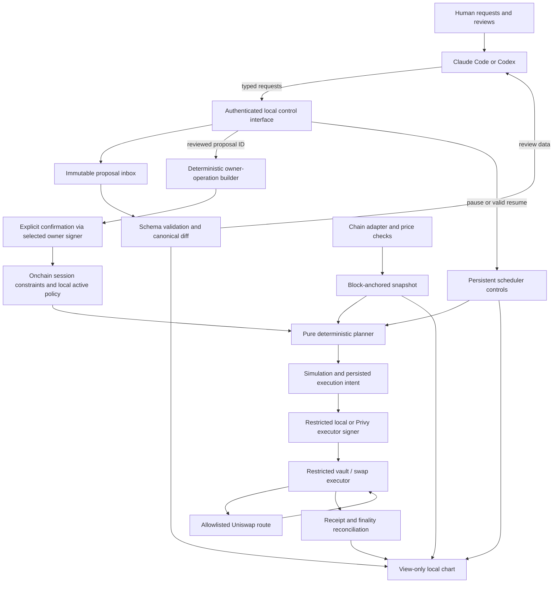

# Rebalance — implementation plan

Created: **2026-09-04**. Track: **ETHOnline 2026, Start from Scratch**.
State: initial plan; no application code or project deployments exist.
Updated: **2026-09-04**, agent-only application interaction and view-only chart, per [owner clarification](docs/prompts/002-agent-only-interaction.md).
Updated: **2026-09-04**, physical Ledger integration deferred until the owner's device arrives, per [availability update](docs/prompts/003-ledger-deferral.md).
Updated: **2026-09-04**, local raw-private-key signing added as a first-class alternative for contributors without hardware; [signer clarification](docs/prompts/004-raw-key-and-privy.md). The owner accepts Privy's TEE trust model, so Privy is the planned third partner with an optional signer mode. No backend is implemented yet.

## 1. Outcome and scope

Build a noncustodial local application that turns owner-approved portfolio targets into reproducible, bounded Uniswap trades on Robinhood Chain. Claude Code/Codex is the sole application command and review interface. The local pie chart is view only. Automatic monitoring, valuation, planning, and execution use deterministic code and never require an LLM.

The hackathon demonstration uses two or three assets, a single quote asset, one verified Uniswap integration, and bounded test funds. Include a stock-like test asset if real Stock Token acquisition, transfer eligibility, pricing, or liquidity is unavailable. Label mocks, local forks, and externally trusted data clearly. Target Robinhood mainnet compatibility without funding or trading a real portfolio as part of this planning task.

### Immediate milestone while Ledger is unavailable

The owner expects the device in a couple of days; no exact arrival date is confirmed. Defer physical device integration, transport/display verification and hardware feedback until the owner confirms availability. This does not block the core, agent interface, view-only chart or simulation work.

Build the deterministic allocation validator/planner and shared owner-signer interface with a real local raw-private-key backend, then connect agent proposal/review operations and a Robinhood/Uniswap simulation using verified manifests or explicitly labelled fixtures/forks. The first acceptance flow is **agent request → canonical proposal and confirmation → local software authorization → simulated swap → view-only chart update**. Repeated planning inputs must produce the same results, and scheduled evaluation must make zero model calls.

Software signing is a supported operational mode, not a test double or a temporary workaround. A selected Ledger backend returns hardware-unavailable when the device is absent; it never silently switches to a raw key. True test doubles remain confined to isolated simulation and cannot authorize live policies or enable broadcasting. A locally executed fork transaction is simulation evidence, not a Robinhood network transaction or Ledger test. Real-network use of the software backend still requires explicit network/account configuration, valid owner approval and the same transaction checks.

When the device arrives, connect the Ledger adapter and verify native transport, meaningful device display and physical confirm/reject/disconnect behavior. Keep Ledger as a primary prize target and a required authorization gate for the hardware-backed flow. Raw-key mode remains available independently after Ledger support is added.

### Required user experience

1. Ask the agent to set up the local application with an explicit signer profile (`private-key`, `ledger` or `privy`) and open the view-only chart showing current/target weights, balances, quote currency, snapshot age, verification status and signer mode. Setup, account selection and funding requests also go through the agent. Raw keys and API credentials are referenced from local secret storage, not supplied in chat.
2. Ask the agent to propose targets or trading limits through typed local operations.
3. Review the canonical before/after allocation, affected limits, costs and errors in the agent conversation. The chart may mirror the preview but has no controls.
4. Ask the agent to initiate authorization of the reviewed proposal. In raw-key or Privy mode, explicitly confirm its exact ID/hash through the agent, then the selected backend signs under its authorization rules. In Ledger mode, confirm the exact operation on the device. Physical device confirmation is the hardware signing step, not a separate application command interface.
5. Ask the agent to enable the scheduler under the approved policy; close the coding assistant and observe a deterministic rebalance when the configured threshold is crossed.
6. Request pause/resume, onchain revocation or owner withdrawal through the agent. The agent reports the actual operation status and the chart reflects it; owner transactions follow the selected signer's confirmation flow.

No allocation editor, settings form, approve/swap button, pause/revoke control, or wallet connection flow lives in the chart. The CLI/local protocol is an implementation interface for the agent, not a second human-operated product workflow. New conversational commands require an available agent; an already enabled scheduler runs without it.

No backend service, remote keeper, hosted portfolio database, LLM market timing, leverage, bridging, arbitrary route search, or mainnet fund deployment is necessary for this MVP. The local scheduler runs only while the machine is awake and the service is running; resumption checks current state instead of replaying every missed interval.

## 2. Trust and privacy contract

- **Account authority:** the explicitly selected Ledger, local raw-key or Privy wallet controls owner authority. Unattended execution uses a distinct limited executor, never owner authority as a fallback: a local session key in local modes, or a scoped Privy executor wallet in Privy mode. Ledger does not sign every automated trade. Each teammate uses independent profiles, owner accounts/vaults and executor credentials; collaboration does not require sharing secrets.
- **Determinism:** equal canonical inputs, policy version, and engine version produce equal plans and plan hashes. Chain state and prices are changing external inputs, not deterministic constants.
- **Local operation:** application data, policy history, planning and the scheduler live on the user's machine. Bundle UI assets; do not use analytics, remote fonts or hosted portfolio services. The owner explicitly accepts Privy's hosted TEE signing for the optional Privy mode. It sends signing requests to Privy; local raw-key/Ledger modes remain independent of that service.
- **Agent boundary:** cloud Codex/Claude use is accepted for the hackathon. Translate explicit user requests into typed operations and present deterministic results; no local model is required. Keep private keys and API secrets out of model access and minimize unrelated balances/history sent to it. Raw-key and Privy management flows trust the authenticated agent channel to convey exact user confirmation; a compromised agent/local host may misuse available authority even without seeing the signing key. Do not equate a TEE with independent proof of the user's intent. Ledger provides a separate physical confirmation step. There is no manual chart editor. General filesystem access can exceed the application's narrow interface; isolate runtime secrets and data from the source checkout.
- **Public chain:** trades, balances, contract state, and any onchain permissions can be observed. Keep exact target weights local where possible; onchain spending/asset limits are public. An unsalted policy hash can expose low-entropy allocations to guessing; if publishing a commitment, bind a random locally stored salt and document what its surrounding metadata still reveals. No claim of transaction anonymity or cryptographically private rebalancing.
- **Verification:** remote RPC is an explicitly weaker mode. A local node independently executes chain state only to the extent its L1 inputs, synchronization, and chain configuration are verified. Neither mode eliminates stock issuer, oracle, sequencer, governance, or software trust.

See [research](docs/RESEARCH.md) for sources. A lightweight verifier is a research gate, not a promised deliverable. Do not invent Robinhood/Nitro support in Helios or treat multiple matching RPC responses as a proof.

## 3. Components and authority

Proposed stack: TypeScript for shared schemas, pure engine, local service and CLI; React with bundled SVG pie charts; SQLite for durable local state; Solidity/Foundry for the restricted executor and contract tests; Ledger DMK/Ethereum Signer Kit for hardware interaction. Pin supported versions and dependency licenses during setup. Keep the engine independent of React, RPC clients, signing libraries, and model SDKs.

Proposed layout (future code, not present today):

| Area | Responsibility |
| --- | --- |
| `packages/core` | Canonical schemas, integer arithmetic, policy diff, pure planner |
| `packages/chain` | Robinhood network manifests, block snapshots, pricing, Uniswap adapter |
| `apps/daemon` | Read-scoped loopback API, separate authenticated control IPC, scheduler, database, transaction recovery |
| `apps/ui` | View-only charts, mirrored proposal previews, status and history; no control or signing access |
| `packages/cli` | Typed agent operations for status, proposals, review, authorization requests and pause/resume |
| `packages/signers` | Shared owner/executor signer interfaces, deterministic operation builder and local raw-private-key backend |
| `packages/ledger` | Optional hardware adapter for the shared interface, native device bridge and device confirmation |
| `packages/privy` | Optional SDK/REST wallet adapter, scoped executor, authorization policies and deterministic API recovery |
| `contracts` | Fixed-purpose owner/session vault and typed swap execution |
| `docs` | Specs, prompts, decisions, evidence, disclosures and prize feedback |

The agent initiates the selected signing backend. Local modes use the local signer/device bridge; Privy mode sends the required wallet operations to its API. After device arrival, verify DMK transport for the native Ledger adapter. The chart has no wallet transport, signer bridge access, signing request capability, or mutation credential. No private keys enter browser JavaScript. Store local keys and API authorization credentials separately from portfolio data in an OS-protected store or protected file outside the checkout; do not promise protection against a fully compromised OS.

## 4. Policy proposals and activation

Use assets identified by **chain ID and contract address**, never ticker alone. Define native ETH versus WETH explicitly. Token metadata, decimals, feed mappings and contract identities come from a pinned, reviewed manifest.

Policy fields include schema/engine version, chain ID, vault, monotonically increasing revision, target weights in basis points, quote asset, redistribution rule, drift threshold, cooldown, minimum trade, gas reserve, max gas fee, slippage/price deviation limits, supported price age, allowed assets/routes, and session expiry/budgets. Integer values are serialized as decimal strings where JavaScript precision could be lost. Define canonical serialization before computing hashes.

“Set ETH from 20% to 30%” is incomplete unless the other weights are specified. Default to a **proposal** that proportionally reduces the other weights from 80% to 70%, returns every new weight for review through the agent, and waits for authorization. Example: ETH 20%, stock-test 40%, quote 40% becomes 30%, 35%, 35%. Allow an explicit alternative such as taking the entire difference from quote. Never silently redistribute an active policy or ask the LLM to decide during scheduled execution.

Reject unknown fields, duplicate assets, negative or noninteger values, weights not totaling 10,000, wrong chains, unsupported tokens and invalid limits. Give fractional basis-point residues to the largest fractional remainders, with a stable address-order tie break; use the same documented rule for every edit.

The agent interface exposes a narrow typed surface:

| Operation | Effect and authority |
| --- | --- |
| `status` | Read permitted snapshots, active policy, operation status and history; request opening the view-only chart |
| `propose` | Validate allocation/limit changes or typed setup, funding, revocation and withdrawal requests; return an immutable proposal ID/hash and canonical diff |
| `review` | Return the exact deterministic proposal, costs, constraints and errors for presentation through the agent |
| `request_owner_authorization` | Reference a reviewed proposal ID/hash and selected account/backend; request explicit agent-mediated confirmation for raw-key/Privy management signing or physical confirmation for Ledger. The deterministic builder and selected signer process only that validated operation |
| `pause` | Immediately and idempotently persist a local stop for new automated submissions; survive restart |
| `resume` | Enable monitoring only under an already approved, unexpired, unrevoked policy with remaining budgets and valid checks; cannot force a trade or renew authority |

The application interface exposes no raw signing payload, arbitrary transaction/call, shell, key-read, or rebalance-now capability. Typed proposal content is data. Models translate user intent; deterministic validators/builders derive transaction fields. The software-signing confirmation is single-use and bound to proposal ID/hash, account, backend, chain and revision; the authenticated agent channel is trusted to convey it. Changing any amount, destination, account, backend, policy or revision invalidates the previous review/authorization request. For MVP withdrawals, bind explicit amounts to the fixed owner destination. Revocation requests also pause locally immediately; report revocation as complete only after onchain confirmation.

The agent starts the approval flow for an exact reviewed proposal through the selected backend. Owner approval binds the policy revision/hash to its chain, vault and nonce/domain. Missing user confirmation, rejected/cancelled requests, unavailable keys, or Ledger disconnect leave the active policy unchanged. Agent-mediated confirmation in raw-key mode is not cryptographic proof of independent human presence. The daemon switches to a new active revision only after required onchain confirmation. Retain previous versions for audit and invalidate older pending plans. Lowering limits follows an explicit revision transition; new allowances or expiry extensions always require fresh owner approval.

## 5. Deterministic rebalance algorithm

1. Capture one block-hash-anchored snapshot of balances, token metadata, vault policy, relevant pool state and price observations. Record verification mode and finality level. Reject mixed-block or unavailable data.
2. Validate price freshness, positive values, feed decimals, sequencer status/recovery grace, stock oracle pause status and supported trading calendar. Robinhood's documented stock feeds already apply corporate-action multipliers; do not apply them a second time. Missing or unvalidated feeds disable that asset's automation.
3. Convert base-unit amounts to fixed-point quote values with explicit integer rational arithmetic and specified rounding directions. Reserve native gas and account for wrapped-native conversion explicitly. No floating point in decision-making or amounts; display-only formatting is separate.
4. Compute current weights and signed differences from target values. If within tolerance, cooldown, or minimum economic trade size, return a structured no-op reason. Do not force exact weights after fees and dust.
5. Construct a stable-order sell-then-buy plan through the quote asset. Restrict pool/path choices to the reviewed manifest. Respect source balances, gas reserve, remaining raw-token spending budgets and permitted routes. Never plan buys against uncertain proceeds; size subsequent legs from confirmed proceeds or use a verified atomic bounded batch. MVP favors one in-flight leg at a time with replanning.
6. Quote against the pinned state, calculate minimum output with conservative rounding, and compare against an independent admissible price bound. A favorable quote alone is not an oracle. Enforce fee, price impact, slippage and deadline limits; reject shallow liquidity and manipulated/deviating prices.
7. Produce a canonical plan with input block/hash, policy revision, amounts, route, minimum output, deadline, nonce assumptions, budget effects and reasons. Simulate locally where possible. Recheck state freshness and authority before signing.
8. Persist the intent before broadcasting, submit only permitted calls, and reconcile receipts. Stop or replan after any changed policy, balance, price, nonce, chain reorganization, or failed leg. The next plan uses actual balances, not expected proceeds.

Use bounded deterministic retries with explicit pause states. Never fall back to an LLM, an unapproved asset, unlimited slippage, or a broader signer when a check fails.

## 6. Owner signers and the onchain execution boundary

All planned backends share address/domain validation and the typed owner-operation contract:

| Backend | Confirmation and key handling | Availability |
| --- | --- | --- |
| `private-key` | Explicit confirmation through the authenticated agent channel; local signer loads a raw key from a secret-store/protected-file reference and signs the validated operation | Implement first; no Ledger required |
| `ledger` | Local bridge requests the owner's physical confirmation; owner private key remains on the device | Integrate after the device arrives |
| `privy` | Agent-mediated confirmation for management operations; scoped API authorization and TEE-backed wallet signing | Planned third-prize mode; integrate after shared core works |

Raw-key support must cover setup, policy authorization, funding, revocation and withdrawal with the same application experience and contract checks. Validate key format without echoing the value, derive the public address locally and match it to the selected vault owner. Only a secret reference, public address and signer metadata cross the agent-facing interface. Do not pass keys through chat, source files, command arguments, logs or cloud context. Never request/export a Ledger seed to enable software compatibility.

Select the signer explicitly per profile; no automatic fallback on Ledger disconnect or missing secrets. A different private key means a different owner address and normally a separate account/vault. Do not imply that switching a config string transfers an existing vault's ownership. Each contributor supplies their own key and isolated local state. Shared custody/multisig is deferred.

Keep the software owner key distinct from the scheduler's session key. Owner signing is used for explicitly reviewed management operations; only the restricted session key is available to recurring execution. Software-mode success validates this shared flow but cannot establish Ledger integration, Clear Signing or physical human approval.

For Privy, implement a substantive wallet-to-swap flow with the same local planner and contract bounds. Provision distinct Privy owner and executor wallet addresses; grant the executor only the vault's narrow rebalance authority. The local scheduler uses scoped executor API authorization, with management credentials unavailable to its recurring execution path. Verify Privy's actual policy/authorization semantics before relying on that separation. Signing requests execute through Privy's TEE/API; the scheduler and its decisions remain local and deterministic. This mode must demonstrate actual Privy wallet use in the financial flow, not merely a one-time unused wallet or adapter.

Privy is explicitly selected per profile and never a fallback for unavailable hardware or keys. Bind wallet IDs/addresses, chain/domain and permissions in the manifest. Handle API failure, rate limits, timeouts and duplicate submissions deterministically, reconciling operation/transaction state before retrying. Do not transfer Ledger or local private keys into Privy merely to switch modes; use separately provisioned accounts/vaults for the MVP.

Prefer a small immutable, non-upgradeable owner-controlled vault/executor over a new general-purpose account framework for this hackathon. Review this choice during the first contract spike; existing audited libraries may reduce the implementation surface, but their licenses and assumptions must be recorded.

The selected owner signer grants a session specific to this chain and vault, binding policy revision, expiry, permitted token pairs/routes, raw-token cumulative spending limits, and custody destination. The session key may call only a typed rebalance/swap entrypoint. It cannot withdraw, change the owner or policy, upgrade, install modules, execute arbitrary calls, `delegatecall`, or grant arbitrary approvals.

The contract independently checks caller, expiry, revision, route/pool identity, exact input and output assets, recipient, budgets and price bounds. Enforce a minimum output derived from an approved fresh onchain price source and deviation limit, not merely a value chosen by the session key. Authenticate any pool callbacks to both the expected pool and active operation. Handle reentrancy and nonstandard token behavior defensively; unsupported transfer-tax/rebasing tokens are excluded.

Router allowlisting alone is insufficient: validate the complete supported calldata/command set, prohibit arbitrary recipients and router subcommands, and constrain token approvals to the amount and spender required. If selecting Universal Router/Permit2, explicitly model its nested command and allowance paths before enabling it; prefer a simpler fixed-route integration if this increases scope.

For the MVP, use lifetime raw-token budgets and short expiry instead of ambiguous rolling windows or resettable USD budgets. Track gross spent amounts so repeated sell/buy cycles cannot replenish the authority. Cap native value and the executor's gas funding as well. Onchain checks bound the session's damage; they do **not** prove globally optimal trades or adherence to private target weights unless that validation is separately implemented.

Expose immediate persistent local pause through the agent and preserve owner-only onchain revoke/withdraw authority independent of the session key. The agent initiates these operations through the selected owner signer. Local pause cannot neutralize a stolen key or cancel an already submitted trade; revocation takes effect when included onchain. Report these states accurately through the agent and view-only chart. If price verification or contract enforcement is incomplete, autonomous mode remains a clearly marked capped test-fund demonstration.

After device arrival, prove actual device/firmware/app versions, chain domain, transaction and typed-data display, cancellation/disconnect behavior and local context resolution. Do not claim Clear Signing from a desktop preview or silently rely on blind signing. The Ledger prize demo must use this hardware path to protect the boundary where an agent proposal becomes spending authority. `wallet-cli ring` is a possible extension only if it preserves the local design; it is not assumed necessary for the chosen DMK direction.

## 7. Local service, verification and recovery

Serve the chart and read-only snapshots on loopback; verify Host and Origin, authenticate reads, prevent CSRF/DNS rebinding and avoid broad CORS. Its read-scoped session cannot reach mutation or signing operations, including state-changing GET requests. Put agent controls on separately authenticated local IPC (for example stdio or an OS-permissioned Unix socket), not the chart's HTTP interface. Keep control credentials out of the browser, URLs, logs and public repository files. Bundle assets and minimize context sent to hardware SDK services; audit actual outbound requests before claiming fully local signing.

Persist states such as proposed, approved, planned, simulated, signed, submitted, confirmed, finalized, failed and paused, including the chain-specific meaning of finality. Use database transactions and a single-writer scheduler lock. Store signed transaction identity privately before broadcast; after a crash, reconcile the same transaction/nonce. Replacements must preserve the authorized trade and respect the gas cap. Never blindly submit a new nonce after a timeout. Handle dropped/reverted/replaced transactions and reorgs explicitly.

Verification modes:

| Mode | Promise and use |
| --- | --- |
| Deterministic local simulation | Synthetic fixtures or labelled fork; no claim of independently verified live state |
| Remote RPC | Fast test integration; endpoint sees requests and supplies state; visible trust warning in status |
| Local Nitro full node | Candidate independent L2 execution path, with verified L1 execution/beacon inputs and documented bootstrap assumptions; substantial hardware requirements |
| Light verifier | Research only until a Robinhood/Nitro-compatible proof and finality path is demonstrated |

No automatic downgrade from a selected verified mode to unverified RPC. A locally exposed RPC URL does not establish that its upstream is verified. Separate block/state integrity from transaction privacy and from rollup/issuer governance.

## 8. Delivery milestones

All dates below are 2026, America/Toronto. Submission cutoff is September 13 at noon; freeze the demo a day earlier.

| Date | Deliverable and acceptance gate |
| --- | --- |
| Sep 4 | Publish this plan, prompts/provenance, rules checklist and owner-bypass branch protection; no imported project code |
| Sep 5 | Implement pure allocation schemas/validator/planner and shared signer interface with local raw-key backend; verify Robinhood manifests and asset/pool/feed availability; choose v3/v4 and a labelled simulation/fork environment; defer physical Ledger work |
| Sep 6 | Connect typed agent proposals/confirmation, software owner signing, simulated Uniswap execution and the view-only chart; fixed fixtures reproduce identical plans; run without any Ledger dependency |
| Sep 7 | Implement narrow contract authority and reject unauthorized operations; submit first participant check-in before 23:59 |
| Sep 8 target, subject to device arrival | After the owner confirms availability, connect and test native Ledger approval with the local executor and verified Uniswap path; collect actual addresses, receipts and signer evidence. Until then continue simulation/contract/recovery work |
| Sep 9 | Finish scheduler durability, fees/budgets, pause/revoke and failure states; run unattended with model processes closed; integrate Privy SDK/REST wallet and scoped executor against the same validated flow |
| Sep 10 | Exercise local/Privy integration and restart/reorg/API-failure cases; collect actual Privy wallet/swap evidence; complete second participant check-in before 23:59 |
| Sep 11 | Review trust claims and dependency licenses, complete real sponsor feedback, write reproducible setup and judge code links |
| Sep 12 | Freeze a working demo; record 2–4 minute human-narrated video and verify it on a clean setup; prepare submission fields |
| Sep 13, before noon | Owner submits to Classic and selected partner tracks; confirm receipt and preserve final submission commit |

Stop/go gates: if stock liquidity is absent, use labelled test assets; if usable hardware authorization fails, report the Ledger gap rather than claiming integration; if no safe oracle exists, keep automatic trades test-only; if light verification is unsupported, document remote/full-node modes without claiming a light node. Never replace Robinhood with another production chain silently.

Physical Ledger work starts on confirmed device availability, not an assumed delivery date. If delivery slips beyond the target milestone, continue independent work and update the hardware/demo schedule; do not claim the Ledger integration or tooling feedback is complete based on mocks.

## 9. Verification plan

- Pure engine: determinism, conservation within explicit rounding, weights totaling 10,000, largest-remainder ties, decimal extremes, zero portfolio, dust, gas reserve, ambiguous edits and stale policy revisions.
- Pricing: paused/stale/nonpositive feeds, corporate-action multiplier handling, closed-market behavior, sequencer downtime/recovery, manipulated pool quote, missing feed and shallow liquidity.
- Contract: owner-only activation/revocation/withdrawal, wrong chain/domain/revision/recipient/token/route, expiry, budget exhaustion, repeated churn, arbitrary-call/approval rejection, callback authentication and malicious-token behavior. Exercise isolated local fixtures; preserve useful invariants and fuzz results.
- Service: one scheduler and in-flight leg, crash before/after broadcast, dropped/replaced/reverted transactions, nonce conflicts, reorgs, restart reconciliation and no unsafe verification fallback.
- Local boundary: origin/host/auth checks, no remote UI assets or telemetry, secrets absent from logs, chart cannot mutate or invoke signing even with its read credential, no wallet/editor/action controls, signer-specific agent trust and filesystem isolation limits documented.
- Agent controls: immutable proposal review/authorization IDs, stale or modified proposal rejection, pause persists across restart, resume cannot renew/revive revoked authority or force trades, truthful pending/confirmed revoke status.
- Software signer: valid/invalid key import by local reference, address mismatch rejection, secret redaction, exact single-use confirmation binding, wrong account/backend/domain rejection, owner/session separation, and functional owner operations in isolated test/fork environments. Confirm absence of Ledger does not block the explicitly selected software backend.
- Before device arrival: deterministic proposal and simulation fixtures, simulated authorization-state transitions, hardware-unavailable behavior only for the selected Ledger backend, no silent signer fallback, and rejection of simulated approvals/state by real activation/broadcast paths. Distinguish real software signatures from mocked authorization and network receipts from fork results.
- Hardware/integration: agent-initiated real Ledger confirm/reject/disconnect, correct domain and meaningful display, device rejection leaves policy unchanged, onchain session activation, successful Uniswap swap, independent rejection of an out-of-policy trade, revocation stopping further execution.
- Privy: real wallet/transaction evidence, owner/executor credential separation, scoped-policy rejection, supported chain/domain checks, service timeout/rate-limit recovery, no duplicate transaction after uncertain response, and local scheduling with zero LLM calls. Verify no local signer mode requires Privy connectivity.

The core demo must show every application request/review through the agent: a complete 20%→30% proposal with redistribution, authorization through the selected signer, a view-only pie chart update, and agent-requested pause or revocation. Show one automatic rebalance with the agent closed and **zero model calls**, its receipt/log, and a blocked action or revoked session. Demonstrate that the raw-key path works without hardware. The Ledger prize evidence separately requires actual device confirmation; software signing or mocks cannot substitute for it. Report tests actually run, along with versions, environments, failures and remaining gaps.

## 10. Prize strategy and deferrals

Planned partners: **Uniswap, Ledger and Privy**. Deliver direct Uniswap integration and feedback, Ledger's physical protection of agent-proposed authority, and a meaningful Privy financial flow. None requires an LLM in the trading loop. [Exact prize requirements](docs/HACKATHON.md) govern the submission.

Third target: **Privy — Best financial flow**. The owner accepts its TEE-based hosted signing trust model. Build a substantive working Privy wallet rebalance mode using official SDK/REST paths while preserving local raw-key and Ledger modes. An unused adapter does not satisfy the prize's core-integration requirement. Technical integration and submission evidence remain gates; trust-model acceptance is resolved. See [the source-backed assessment](docs/PRIVY.md).

Defer 1inch Aqua: Privy occupies the third planned partner slot. Do not add a fourth selection. Chainlink CRE is also deferred because it requires a separate substantial integration; ordinary feed consumption does not qualify. Revisit partner selection only if delivery evidence requires a scope change.

Defer production audits, real-stock custody, multi-chain routing, tax accounting, forecasting, generalized arbitrary tokens, smart-account ecosystem integrations, private order flow, and building a new Nitro light client. Update this plan through dated commits as evidence changes; preserve earlier history and disclose AI assistance throughout.
