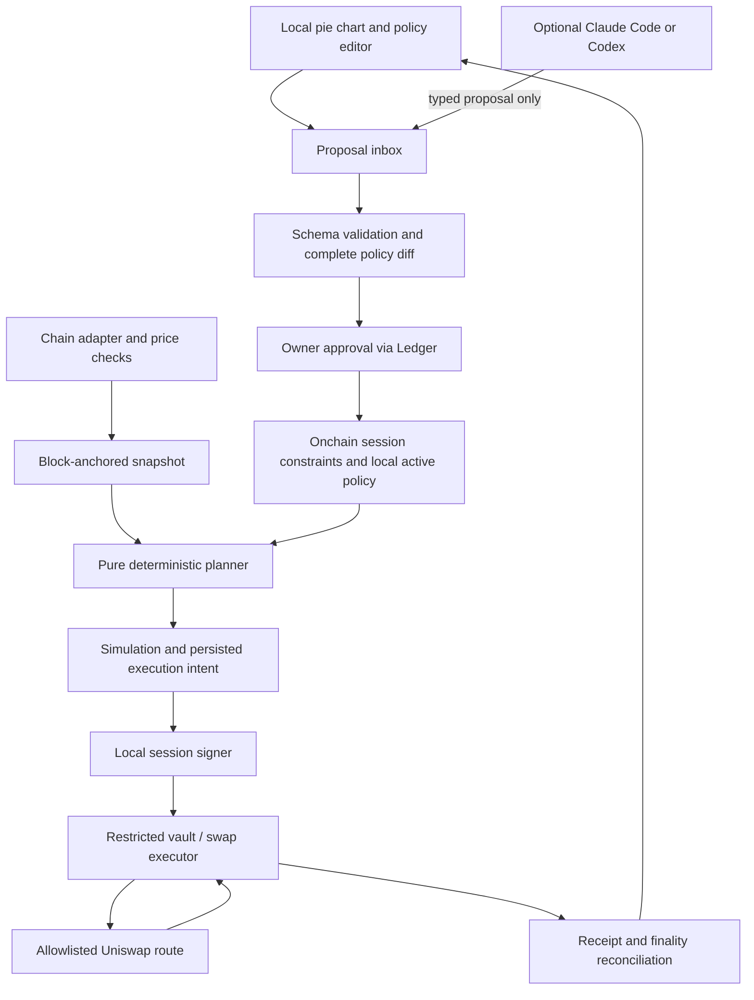

# Rebalance — implementation plan

Created: **2026-09-04**. Track: **ETHOnline 2026, Start from Scratch**.
State: initial plan; no application code or project deployments exist.

## 1. Outcome and scope

Build a noncustodial local application that turns owner-approved portfolio targets into reproducible, bounded Uniswap trades on Robinhood Chain. The owner can edit a local pie chart or use Claude Code/Codex to propose an edit. Automatic monitoring, valuation, planning, and execution use deterministic code and never require an LLM.

The hackathon demonstration uses two or three assets, a single quote asset, one verified Uniswap integration, and bounded test funds. Include a stock-like test asset if real Stock Token acquisition, transfer eligibility, pricing, or liquidity is unavailable. Label mocks, local forks, and externally trusted data clearly. Target Robinhood mainnet compatibility without funding or trading a real portfolio as part of this planning task.

### Required user experience

1. Open the locally served UI and see current/target pie charts, balances, quote currency, snapshot age, and verification status.
2. Propose targets through the UI or a narrow agent-facing local command.
3. See a complete before/after allocation, affected trade limits, costs, and unresolved errors.
4. Approve a new policy and bounded session authority using Ledger.
5. Enable the local scheduler; close the coding assistant and observe a deterministic rebalance when the configured threshold is crossed.
6. Pause locally, revoke the session onchain, or withdraw using owner authority. Show clearly when a pause is local versus confirmed onchain.

No backend service, remote keeper, hosted portfolio database, LLM market timing, leverage, bridging, arbitrary route search, or mainnet fund deployment is necessary for this MVP. The local scheduler runs only while the machine is awake and the service is running; resumption checks current state instead of replaying every missed interval.

## 2. Trust and privacy contract

- **Self custody:** Ledger controls owner authority. Unattended execution requires a limited local hot key; Ledger does not sign every automated trade.
- **Determinism:** equal canonical inputs, policy version, and engine version produce equal plans and plan hashes. Chain state and prices are changing external inputs, not deterministic constants.
- **Local operation:** application data, policy history, and the scheduler live on the user's machine. Bundle UI assets; do not use analytics, remote fonts, or hosted portfolio services.
- **Agent boundary:** the owner explicitly accepts cloud Codex/Claude use for the hackathon. Use it for proposals with the requested edit, asset identifiers, and necessary policy context; no local model is required. Keep secrets and signing authority out of model access, and minimize unrelated balances/history sent to it. Manual editing remains available. A user who grants a coding agent general filesystem access can exceed the narrow application boundary; isolate runtime secrets and data from the source checkout.
- **Public chain:** trades, balances, contract state, and any onchain permissions can be observed. Keep exact target weights local where possible; onchain spending/asset limits are public. An unsalted policy hash can expose low-entropy allocations to guessing; if publishing a commitment, bind a random locally stored salt and document what its surrounding metadata still reveals. No claim of transaction anonymity or cryptographically private rebalancing.
- **Verification:** remote RPC is an explicitly weaker mode. A local node independently executes chain state only to the extent its L1 inputs, synchronization, and chain configuration are verified. Neither mode eliminates stock issuer, oracle, sequencer, governance, or software trust.

See [research](docs/RESEARCH.md) for sources. A lightweight verifier is a research gate, not a promised deliverable. Do not invent Robinhood/Nitro support in Helios or treat multiple matching RPC responses as a proof.

## 3. Components and authority

Proposed stack: TypeScript for shared schemas, pure engine, local service and CLI; React with bundled SVG pie charts; SQLite for durable local state; Solidity/Foundry for the restricted executor and contract tests; Ledger DMK/Ethereum Signer Kit for hardware interaction. Pin supported versions and dependency licenses during setup. Keep the engine independent of React, RPC clients, signing libraries, and model SDKs.

Proposed layout (future code, not present today):

| Area | Responsibility |
| --- | --- |
| `packages/core` | Canonical schemas, integer arithmetic, policy diff, pure planner |
| `packages/chain` | Robinhood network manifests, block snapshots, pricing, Uniswap adapter |
| `apps/daemon` | Loopback API, scheduler, database, transaction recovery |
| `apps/ui` | Local charts, policy review, status, pause/revoke workflows |
| `packages/cli` | Proposal-only commands for people and coding agents |
| `packages/ledger` | Device connection, policy/transaction review and signing |
| `contracts` | Fixed-purpose owner/session vault and typed swap execution |
| `docs` | Specs, prompts, decisions, evidence, disclosures and prize feedback |

The UI may use a local signer bridge or browser transport according to verified DMK support. No private keys enter browser JavaScript. Store the executor key separately from portfolio data using an OS-protected secret store where supported; do not promise protection against a fully compromised OS.

## 4. Policy proposals and activation

Use assets identified by **chain ID and contract address**, never ticker alone. Define native ETH versus WETH explicitly. Token metadata, decimals, feed mappings and contract identities come from a pinned, reviewed manifest.

Policy fields include schema/engine version, chain ID, vault, monotonically increasing revision, target weights in basis points, quote asset, redistribution rule, drift threshold, cooldown, minimum trade, gas reserve, max gas fee, slippage/price deviation limits, supported price age, allowed assets/routes, and session expiry/budgets. Integer values are serialized as decimal strings where JavaScript precision could be lost. Define canonical serialization before computing hashes.

“Set ETH from 20% to 30%” is incomplete unless the other weights are specified. Default to a **proposal** that proportionally reduces the other weights from 80% to 70%, displays every new weight, and waits for approval. Example: ETH 20%, stock-test 40%, quote 40% becomes 30%, 35%, 35%. Allow an explicit alternative such as taking the entire difference from quote. Never silently redistribute an active policy or ask the LLM to decide during scheduled execution.

Reject unknown fields, duplicate assets, negative or noninteger values, weights not totaling 10,000, wrong chains, unsupported tokens and invalid limits. Give fractional basis-point residues to the largest fractional remainders, with a stable address-order tie break; use the same documented rule for every edit.

The agent interface accepts only typed proposals and returns a diff plus proposal ID. It has no activate, approve, sign, arbitrary transaction, shell, key-read, or rebalance-now capability. Proposal content is data, not executable instructions. UI actions and CLI proposals share validators.

Owner approval binds the policy revision/hash to its chain, vault and nonce/domain. The daemon switches to the new active revision only after the required onchain confirmation. Retain previous versions for audit and invalidate older pending plans. Lowering limits also follows an explicit revision transition. New allowances or expiry extensions always require owner approval.

## 5. Deterministic rebalance algorithm

1. Capture one block-hash-anchored snapshot of balances, token metadata, vault policy, relevant pool state and price observations. Record verification mode and finality level. Reject mixed-block or unavailable data.
2. Validate price freshness, positive values, feed decimals, sequencer status/recovery grace, stock oracle pause status and supported trading calendar. Robinhood's documented stock feeds already apply corporate-action multipliers; do not apply them a second time. Missing or unvalidated feeds disable that asset's automation.
3. Convert base-unit amounts to fixed-point quote values with explicit integer rational arithmetic and specified rounding directions. Reserve native gas and account for wrapped-native conversion explicitly. No floating point in decision-making or amounts; display-only formatting is separate.
4. Compute current weights and signed differences from target values. If within tolerance, cooldown, or minimum economic trade size, return a structured no-op reason. Do not force exact weights after fees and dust.
5. Construct a stable-order sell-then-buy plan through the quote asset. Restrict pool/path choices to the reviewed manifest. Respect source balances, gas reserve, remaining raw-token spending budgets and permitted routes. Never plan buys against uncertain proceeds; size subsequent legs from confirmed proceeds or use a verified atomic bounded batch. MVP favors one in-flight leg at a time with replanning.
6. Quote against the pinned state, calculate minimum output with conservative rounding, and compare against an independent admissible price bound. A favorable quote alone is not an oracle. Enforce fee, price impact, slippage and deadline limits; reject shallow liquidity and manipulated/deviating prices.
7. Produce a canonical plan with input block/hash, policy revision, amounts, route, minimum output, deadline, nonce assumptions, budget effects and reasons. Simulate locally where possible. Recheck state freshness and authority before signing.
8. Persist the intent before broadcasting, submit only permitted calls, and reconcile receipts. Stop or replan after any changed policy, balance, price, nonce, chain reorganization, or failed leg. The next plan uses actual balances, not expected proceeds.

Use bounded deterministic retries with explicit pause states. Never fall back to an LLM, an unapproved asset, unlimited slippage, or a broader signer when a check fails.

## 6. Ledger and the onchain execution boundary

Prefer a small immutable, non-upgradeable owner-controlled vault/executor over a new general-purpose account framework for this hackathon. Review this choice during the first contract spike; existing audited libraries may reduce the implementation surface, but their licenses and assumptions must be recorded.

The owner uses Ledger to grant a session specific to this chain and vault, binding policy revision, expiry, permitted token pairs/routes, raw-token cumulative spending limits, and custody destination. The session key may call only a typed rebalance/swap entrypoint. It cannot withdraw, change the owner or policy, upgrade, install modules, execute arbitrary calls, `delegatecall`, or grant arbitrary approvals.

The contract independently checks caller, expiry, revision, route/pool identity, exact input and output assets, recipient, budgets and price bounds. Enforce a minimum output derived from an approved fresh onchain price source and deviation limit, not merely a value chosen by the session key. Authenticate any pool callbacks to both the expected pool and active operation. Handle reentrancy and nonstandard token behavior defensively; unsupported transfer-tax/rebasing tokens are excluded.

Router allowlisting alone is insufficient: validate the complete supported calldata/command set, prohibit arbitrary recipients and router subcommands, and constrain token approvals to the amount and spender required. If selecting Universal Router/Permit2, explicitly model its nested command and allowance paths before enabling it; prefer a simpler fixed-route integration if this increases scope.

For the MVP, use lifetime raw-token budgets and short expiry instead of ambiguous rolling windows or resettable USD budgets. Track gross spent amounts so repeated sell/buy cycles cannot replenish the authority. Cap native value and the executor's gas funding as well. Onchain checks bound the session's damage; they do **not** prove globally optimal trades or adherence to private target weights unless that validation is separately implemented.

Provide immediate local pause and an owner-only onchain revoke/withdraw path independent of the session. Explain that local pause cannot neutralize a stolen key; revocation takes effect when included onchain, and an already submitted trade may execute first. If price verification or contract enforcement is incomplete, autonomous mode remains a clearly marked capped test-fund demonstration.

Prove hardware behavior early: actual device/firmware/app versions, chain domain, transaction and typed-data display, cancellation and disconnect behavior, and local context resolution. Do not claim Clear Signing from a desktop preview or silently rely on blind signing. Ledger's AI track should visibly protect the boundary where an agent proposal becomes spending authority. `wallet-cli ring` is a possible extension only if it preserves the local design; it is not assumed necessary for the chosen DMK direction.

## 7. Local service, verification and recovery

Bind the service to loopback, verify Host and Origin, authenticate mutations, prevent CSRF/DNS rebinding, and avoid broad CORS. Default reads also require the local session because balances are sensitive. Keep credentials out of URLs, logs and public repository files. Bundle assets and minimize context sent to hardware SDK services; audit actual outbound requests before claiming fully local signing.

Persist states such as proposed, approved, planned, simulated, signed, submitted, confirmed, finalized, failed and paused, including the chain-specific meaning of finality. Use database transactions and a single-writer scheduler lock. Store signed transaction identity privately before broadcast; after a crash, reconcile the same transaction/nonce. Replacements must preserve the authorized trade and respect the gas cap. Never blindly submit a new nonce after a timeout. Handle dropped/reverted/replaced transactions and reorgs explicitly.

Verification modes:

| Mode | Promise and use |
| --- | --- |
| Deterministic local simulation | Synthetic fixtures or labelled fork; no claim of independently verified live state |
| Remote RPC | Fast test integration; endpoint sees requests and supplies state; visible trust warning in status |
| Local Nitro full node | Candidate independent L2 execution path, with verified L1 execution/beacon inputs and documented bootstrap assumptions; substantial hardware requirements |
| Light verifier | Research only until a Robinhood/Nitro-compatible proof and finality path is demonstrated |

No automatic downgrade from a selected verified mode to unverified RPC. A locally exposed RPC URL does not establish that its upstream is verified. Separate block/state integrity from transaction privacy and from rollup/issuer governance.

## 8. Delivery milestones

All dates below are 2026, America/Toronto. Submission cutoff is September 13 at noon; freeze the demo a day earlier.

| Date | Deliverable and acceptance gate |
| --- | --- |
| Sep 4 | Publish this plan, prompts/provenance, rules checklist and owner-bypass branch protection; no imported project code |
| Sep 5 | Prove network manifests, asset/pool/feed availability and actual Ledger policy-signing display; decide v3/v4 integration and labelled test/fork environment; document light-client outcome |
| Sep 6 | Implement pure schemas/planner and local pie-chart vertical slice; fixed fixtures reproduce identical results; agent edit remains a proposal |
| Sep 7 | Implement narrow contract authority and reject unauthorized operations; submit first participant check-in before 23:59 |
| Sep 8 | Connect Ledger approval, local executor and verified Uniswap path; collect addresses, receipts and truthful signer evidence |
| Sep 9 | Finish scheduler durability, fees/budgets, pause/revoke and failure states; run unattended with model processes closed |
| Sep 10 | Exercise integration and restart/reorg/failure cases; complete second participant check-in before 23:59; decide whether any third prize fits |
| Sep 11 | Review trust claims and dependency licenses, complete real sponsor feedback, write reproducible setup and judge code links |
| Sep 12 | Freeze a working demo; record 2–4 minute human-narrated video and verify it on a clean setup; prepare submission fields |
| Sep 13, before noon | Owner submits to Classic and selected partner tracks; confirm receipt and preserve final submission commit |

Stop/go gates: if stock liquidity is absent, use labelled test assets; if usable hardware authorization fails, report the Ledger gap rather than claiming integration; if no safe oracle exists, keep automatic trades test-only; if light verification is unsupported, document remote/full-node modes without claiming a light node. Never replace Robinhood with another production chain silently.

## 9. Verification plan

- Pure engine: determinism, conservation within explicit rounding, weights totaling 10,000, largest-remainder ties, decimal extremes, zero portfolio, dust, gas reserve, ambiguous edits and stale policy revisions.
- Pricing: paused/stale/nonpositive feeds, corporate-action multiplier handling, closed-market behavior, sequencer downtime/recovery, manipulated pool quote, missing feed and shallow liquidity.
- Contract: owner-only activation/revocation/withdrawal, wrong chain/domain/revision/recipient/token/route, expiry, budget exhaustion, repeated churn, arbitrary-call/approval rejection, callback authentication and malicious-token behavior. Exercise isolated local fixtures; preserve useful invariants and fuzz results.
- Service: one scheduler and in-flight leg, crash before/after broadcast, dropped/replaced/reverted transactions, nonce conflicts, reorgs, restart reconciliation and no unsafe verification fallback.
- Local boundary: origin/host/auth checks, no remote UI assets or telemetry, secrets absent from logs, agent interface cannot activate/sign, filesystem isolation limits documented.
- Hardware/integration: real Ledger confirm/reject/disconnect, correct domain and meaningful display, onchain session activation, successful Uniswap swap, independent rejection of an out-of-policy trade, revocation stopping further execution.

The final demo must show a complete 20%→30% proposal with redistribution, human authorization, a pie chart update, one automatic rebalance with **zero model calls**, an execution receipt/log, and a blocked action or revoked session. Report tests actually run, along with versions, environments, failures and remaining gaps.

## 10. Prize strategy and deferrals

Primary: direct Uniswap integration plus reproducible tooling/feedback, and Ledger's visible protection of agent-proposed authority. Neither requires an LLM in the trading loop. [Exact prize requirements](docs/HACKATHON.md) govern the submission.

Optional third: 1inch Aqua only if the core is complete and a distinct Aqua/SwapVM position integration with transfers can be demonstrated. An ordinary quote call does not qualify. Defer Chainlink CRE confidential compute because its required TEE handler changes the local-only architecture; using a Chainlink price feed alone is not that prize integration.

Defer production audits, real-stock custody, multi-chain routing, tax accounting, forecasting, generalized arbitrary tokens, smart-account ecosystem integrations, private order flow, and building a new Nitro light client. Update this plan through dated commits as evidence changes; preserve earlier history and disclose AI assistance throughout.
