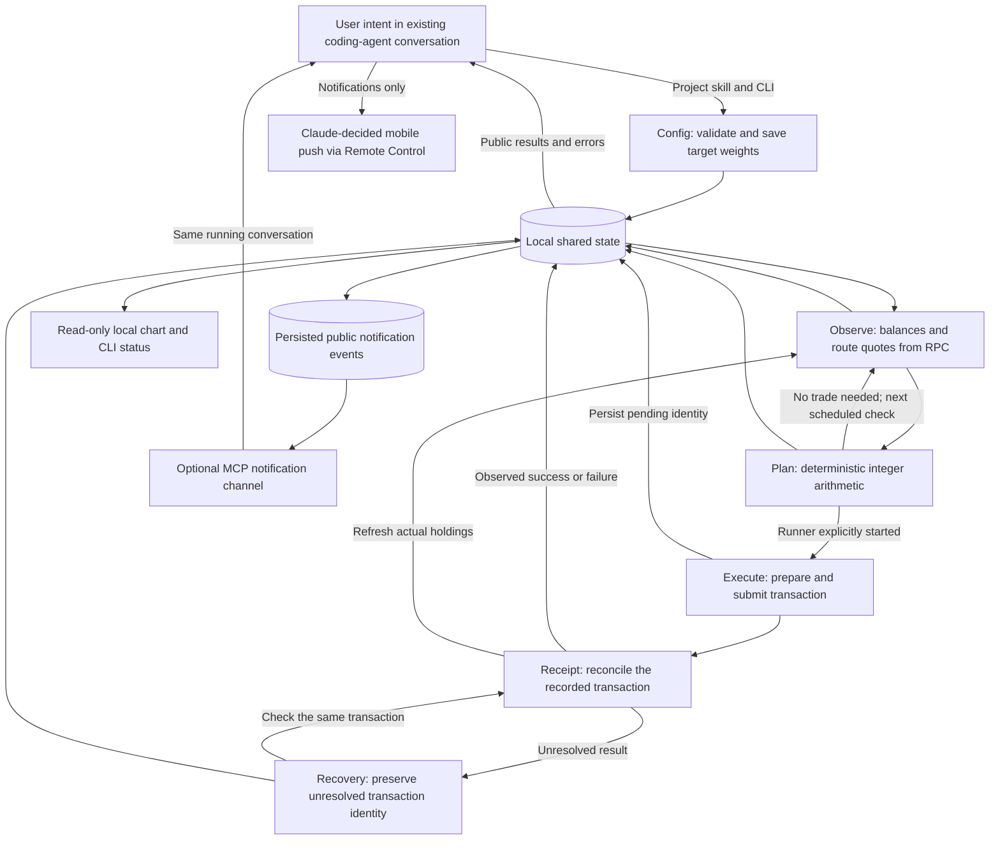

# Rebalance's agent graph

The user's existing Codex or Claude Code conversation is the interactive interface. A project skill translates intent into CLI operations. The local runner then executes a graph of deterministic stages with shared state and transaction feedback. It does not call another model, spawn subagents, or require an agent framework. Core trading requires no MCP server; an optional notification channel can deliver events into the running Claude conversation.

The separation of target ownership, shared state, and external observations takes inspiration from [Rob Cressy's “Loops to Graphs” article](https://robcressy.com/blog/loops-to-graphs-ai-agent-systems). The user decides the allocation; the application measures drift and carries out that choice.

## Responsibility and shared state

| Stage | Reads | Produces |
| --- | --- | --- |
| Intent/config | The user's request and saved public configuration | Validated targets and execution settings |
| Observe | Configuration, wallet address, RPC chain state and route quotes | Balances, quote-derived values and current weights |
| Plan | Observed portfolio and configured targets | A deterministic trade proposal or no-trade result |
| Execute | An authorized running configuration and current plan | Submission result and a durable transaction identity |
| Receipt/recovery | Pending identity and RPC transaction/receipt observations | A resolved result or an unresolved state that blocks blind replacement |

Local configuration, status, and transaction records connect the stages. The signing key is separate from public status and is consumed by the local signer, never supplied to the coding agent or browser. Status can expose the current graph node and recent trace; the chart only reads this state.

Changing a target does not fabricate a new holding. A submitted transaction does not immediately count as a successful rebalance. Receipt feedback resolves its recorded identity, and a subsequent observation measures the actual portfolio again. The next plan uses those observations rather than an LLM's description of the previous outcome.

## Operation from one conversation

The [Rebalance skill](../skills/rebalance/SKILL.md) is the bridge from natural language to CLI. “Set USDG to 30%” changes a target; it does not require an LLM to choose amounts on every price movement. “Start automatic rebalancing” starts the local recurring process and authorizes its subsequent swaps under the saved configuration. Status, stop, graph inspection, and chart requests use the same conversation.

The graph continues after the LLM conversation closes while the local runner and computer remain running. The only model involvement is interpreting user requests and explaining public results. There is no model scheduler or repeated prompt inside the trading loop. The chart has no buttons, forms, signing prompts, or configuration controls.

## Notification feedback

The optional `rebalance-events` MCP channel reads persisted public events and pushes them into the existing running Claude Code session. Events describe a required Ledger device action when that adapter is available, or a completed automatic rebalance after chain receipt confirmation. The channel only delivers notifications and acknowledges handled events; it has no signing or permission-relay tools. The `events` and `events ack ID` CLI commands provide the same queue's manual inspection and acknowledgement path.

When the project's channel server is configured, start Claude with `claude --dangerously-load-development-channels server:rebalance-events --remote-control`; add `--continue` or resume the chosen prior session to retain its conversation. The user accepts Claude's project/channel consent. `/rc` connects an existing session to Remote Control. This optional setup does not change global settings or make phone approval part of the deterministic execution graph. [Claude channel documentation](https://code.claude.com/docs/en/channels), [CLI flags](https://code.claude.com/docs/en/cli-usage).

Phone push requires Claude Code 2.1.110 or later, the mobile app using the same account and organization, OS notification permission, and `/config` → `Push when Claude decides` with Remote Control active. Claude decides whether to send a push; queue acknowledgement is not proof of phone delivery. If Claude is closed, notifications wait while the local trading process keeps operating. [Remote Control notification behavior](https://code.claude.com/docs/en/remote-control).

## What anchors the graph

The current chain is Robinhood mainnet, ID 4663. The portfolio has five assets: USDG, TSLA, AAPL, NVDA, and AMZN, with canonical contracts taken from the verified manifest. Native ETH is kept outside the allocation as gas. Integer arithmetic conserves allocation basis points and determines trade amounts. Fresh onchain DEX quotes provide USDG-equivalent valuations rather than a USD oracle price. Listing an asset is separate from proving that its route can execute at a particular moment.

Stock-token pricing has an additional issuer and market boundary. ERC-20 token quantities need not equal underlying shares after dividends or splits. A DEX quote already prices the actual tokens, so applying the share multiplier again would double-count the adjustment. The application halts on a token's corporate-action `oraclePaused()` flag. It uses DEX quotes rather than an invented underlying-market calendar: DEX prices can differ from underlying stock prices, including off-hours. These conditions are separate from primary-market mint/redemption permissions or a particular wallet's ability to transfer tokens. Robinhood's optional Chainlink feeds also incorporate the multiplier already and can hold earlier prices through closed sessions. [Robinhood integration semantics](https://docs.robinhood.com/chain/building-with-stock-tokens/), [Chainlink stock-feed behavior](https://docs.chain.link/data-feeds/tokenized-equity-feeds/robinhood).

RPC observations of balances and receipts connect the local state to chain activity. They remain RPC claims, not locally verified consensus proofs. A successful RPC response, transaction hash, or internally consistent graph trace is not by itself proof that the intended swap finalized. The MVP must be described as RPC mode, with this trust boundary visible.

Recovery keeps uncertain transactions attached to their original records. It rechecks the same transaction instead of clearing pending state and sending again. An unresolved receipt requires investigation or later observations; absence of a receipt alone does not establish failure. Stop ends future scheduling but cannot reverse a broadcast transaction.

The current executable signer is a local private key. Privy and Ledger are deferred integrations. This graph does not imply that Ledger can sign unattended or that a hosted signer preserves entirely local operation.
